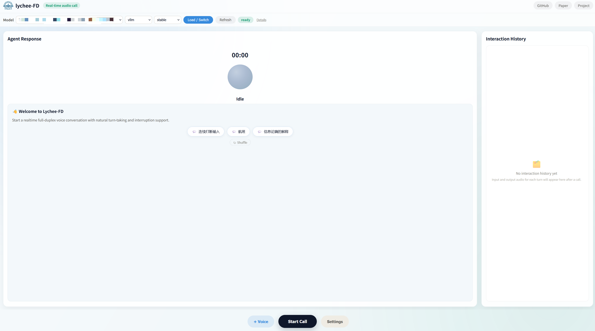
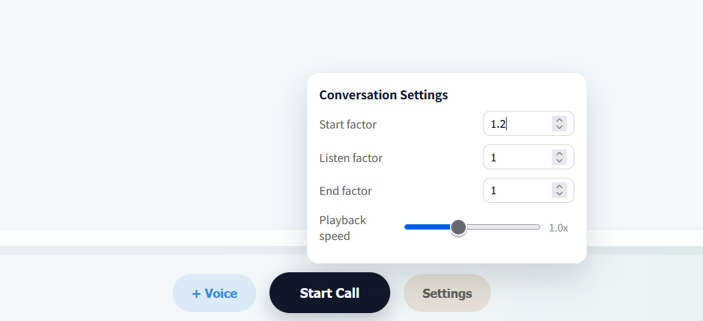
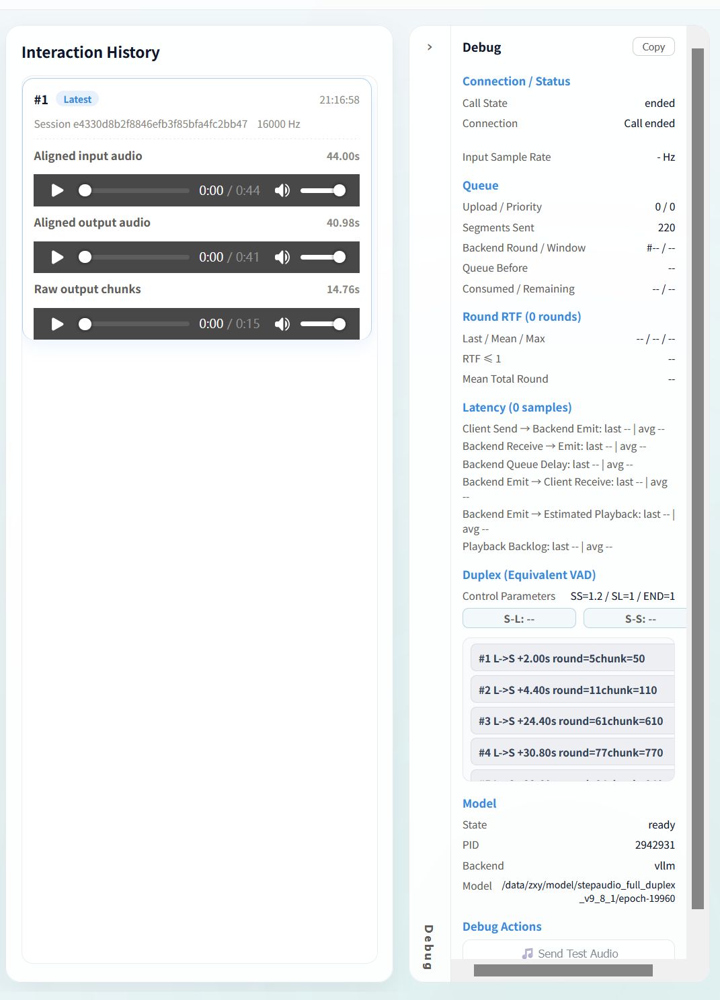

# Lychee-FD FAQ and Troubleshooting Guide

[中文](FAQ_CN.md)

This guide focuses on **source-based deployment**. Complete the [Source Installation](README.md#source-installation) steps before using this guide. Docker troubleshooting is intentionally outside its scope.

## 1. Which UI should I use, and why is the backend Gradio page not recommended for realtime conversations?

For realtime interaction, we recommend using our Lychee-FD frontend:

```text
http://127.0.0.1:8084
```

The backend Gradio page is mainly retained for model loading, single-run inference, and low-level diagnostics. Because of the Gradio component and event lifecycle, it does not reproduce the complete long-running realtime experience provided by Lychee-FD, including:

- continuous microphone chunk uploads;
- persistent conversational and full-duplex state in one session;
- server-sent events and incremental PCM playback;
- interruption handling while the user is speaking;
- buffering, scheduling, and seamless playback of consecutive audio chunks.

Our frontend uses the Lychee-FD realtime session API and adds playback buffering, smooth playback-rate control, audio-chunk scheduling, interruption handling, and interaction history. For the most representative assessment, evaluate realtime conversation quality with our frontend; the Gradio single-run page is better suited to low-level diagnostics.

<p align="center">
  
</p>

Basic workflow:

1. Select the model preset, `vllm`, and `stable` at the top of the page.
2. Click **Load / Switch** and wait for the state to become `ready`.
3. Select a voice and click **Start Call**.
4. Allow microphone access when prompted by the browser.
5. Click **End Call** when finished. Input and output audio will appear in Interaction History.

The `ready` state means that the controller can reach the backend service. Use the log checks in Section 3 to confirm that vLLM, model weights, and Token2Wav are fully initialized.

## 2. How can I make the model start replying earlier?

Open **Settings** at the bottom of the frontend and gradually increase **Start factor**.

<p align="center">
  
</p>

`Start factor` biases the S-S (Start Speaking) control token. A higher value generally makes the model more likely to transition from listening to speaking, so it may start replying earlier.

Start from the default value of `1.2` and increase it in small steps such as `0.1`. A value that is too high may cause premature replies or false starts before the user finishes speaking. This setting affects the decision of *when* to speak; it does not reduce the computation time of a model forward pass.

**Playback speed** only changes browser playback speed and does not reduce inference latency.

## 3. How do I verify that Token2Wav, vLLM, and the main model started successfully?

Backend processes launched by the controller write logs to:

```text
runtime_logs/controller/backend_dev_*.log
```

Inspect the latest log for the important markers:

```bash
latest_log="$(ls -t runtime_logs/controller/backend_dev_*.log 2>/dev/null | head -n 1)"

grep -nE \
'resolved_vllm=|Remote Token2Wav health|Initializing an LLM engine|load_weights summary|Initialized with vLLM backend|Model loaded in|Running on local URL|ERROR|Traceback' \
"${latest_log}"
```

A successful startup should eventually contain messages similar to:

```text
[backend] resolved_vllm=.../third_party/vllm/vllm/__init__.py
Remote Token2Wav health: {'ok': True, ...}
Initializing an LLM engine (v0.6.5)
Lychee-FD load_weights summary: ... unmatched=0
[VLLMGenerationFramework] Initialized with vLLM backend
Model loaded in ...s
Running on local URL: http://0.0.0.0:7860
```

Check the following:

- `resolved_vllm` must point to this repository's `third_party/vllm`. A path under plain `site-packages/vllm` means that the patched Lychee-FD serving implementation is not being used.
- `Remote Token2Wav health` should contain `ok: True`.
- The weight summary should report `unmatched=0`.
- The final log should contain `Initialized with vLLM backend`, `Model loaded in`, and `Running on local URL`.

A single `Traceback` does not necessarily mean that startup failed. Some configuration loaders print a traceback before falling back successfully. Check the end of the log for all success markers and confirm that the process remains alive.

## 4. Why does Start Call remain at Connecting?

Starting a call creates a realtime session, connects the event stream, requests microphone permission, and initializes the audio device. A failure at any stage can prevent the call from connecting.

Check the following first:

1. The model state at the top of the frontend is `ready`.
2. All vLLM, model, and Token2Wav success markers from Section 3 are present.
3. The browser has permission to use the microphone.
4. The browser can reach the backend on port `7860`.

In the browser developer tools, inspect the **Network** panel:

- `POST /api/realtime/session/start` should return HTTP 200 with a `session_id`.
- `GET /api/realtime/session/<session_id>/events` is a long-lived SSE request; remaining pending is normal.
- HTTP 503 from `session/start` usually means that the main model or Token2Wav is not ready.
- If `session/start` remains pending, inspect the backend log for a blocked or long-running operation.
- `Failed to fetch` usually indicates an unreachable port, proxy interception, CORS, or HTTPS-to-HTTP mixed-content blocking.

For a remote server, forward both the frontend and backend ports:

```bash
ssh -L 8084:127.0.0.1:8084 \
    -L 7860:127.0.0.1:7860 \
    user@server
```

Then open:

```text
http://127.0.0.1:8084
```

Browsers generally allow microphone access only in a secure context such as HTTPS or localhost. Opening a remote server through plain HTTP may block microphone access.

## 5. How do I read RTF, and what result indicates realtime performance?

Open the **Debug** drawer on the right side of the main frontend. It reports the current session's Round RTF:

```text
Round RTF
Last / Mean / Max
RTF ≤ 1
Mean Total Round
```

<p align="center">
  
</p>

Round RTF is defined as:

```text
RTF = total_round_ms / actual_input_duration_ms
```

- `RTF ≤ 1` means that a round is processed fast enough to keep up with its input audio.
- The `RTF ≤ 1` row reports passed rounds / total rounds and the corresponding percentage.
- With a 400 ms input window, `RTF ≤ 1` is equivalent to `total_round ≤ 400 ms`.
- The final round may be shorter than 400 ms, so the implementation uses the actual duration of every round.

Actual RTF varies with GPU and CPU performance, drivers, model configuration, and system load. After testing several conversation rounds, an `RTF ≤ 1` rate above 90% is generally sufficient for a normal, smooth realtime interaction experience. A higher percentage provides more realtime headroom.

The fixed-audio test page is available at:

```text
http://127.0.0.1:8084/weight-test.html
```

The **Token2Wav RTF** shown on that page measures vocoder synthesis speed only. It is not the same as full Round RTF. Use Round RTF and the `RTF ≤ 1` percentage in the Debug drawer to assess whether the main realtime pipeline keeps up.

## 6. Why is audio still choppy or slow on a high-end GPU?

High-end hardware alone does not guarantee that the intended serving path is active. Common causes include:

- importing plain `site-packages/vllm` instead of `third_party/vllm`;
- accidentally using the `hf` backend instead of the low-latency `vllm` path;
- Round RTF above 1, causing the input queue to grow continuously;
- Token2Wav synthesis or its remote request path falling behind playback;
- sharing a memory-constrained GPU between the main model and Token2Wav;
- browser playback backlog, network jitter, or proxy interference.

Check in this order:

1. Whether the `RTF ≤ 1` percentage in Debug is above 90%.
2. Whether `Queue Before` and `Consumed / Remaining` continue to grow.
3. Whether `Playback Backlog` continues to grow.
4. Whether Token2Wav RTF is frequently above 1 on `/weight-test.html`.
5. Whether the log reports the correct `resolved_vllm` path and backend type.

Changing one inference parameter at a time and recording the result makes it easier to identify which setting affected performance.

## 7. What should I do when CUDA runs out of memory?

With two GPUs, place Token2Wav and the main backend on different devices:

```bash
# Token2Wav process
CUDA_VISIBLE_DEVICES=0 \
LYCHEEFD_T2W_MODEL_PATH=/path/to/token2wav \
./scripts/start_token2wav_server.sh

# Frontend controller and main backend process
CUDA_VISIBLE_DEVICES=1 \
./scripts/start_frontend_dev.sh prod public
```

When both components must share one GPU, reduce the vLLM KV-cache budget and maximum context length:

```bash
export LYCHEEFD_VLLM_GPU_MEMORY_UTILIZATION=0.70
export LYCHEEFD_VLLM_MAX_MODEL_LEN=8192
```

Lower values reduce memory consumption at the cost of KV-cache capacity. The released online pipeline primarily uses one GPU for the main backend and another for Token2Wav. Exposing multiple GPUs alone does not automatically enable tensor parallelism.

## 8. Suggestions for organizing an Issue report

The following checklist is intended only to help organize a problem report. Relevant items can be selected according to the situation:

- the current Git commit from `git rev-parse HEAD`;
- operating system, CPU architecture, GPU, driver, and CUDA information;
- Python, PyTorch, vLLM, and Transformers versions;
- the actual value of `vllm.__file__`;
- relevant launch commands and environment variables;
- the startup section and final error section of the latest `runtime_logs/controller/backend_dev_*.log`;
- exact reproduction steps, expected behavior, and actual behavior;
- a browser Network/Console screenshot for Connecting problems;
- Round RTF, the `RTF ≤ 1` percentage, GPU model, and inference window for performance problems.

The following command can help collect Python component information:

```bash
python - <<'PY'
import platform
import torch
import transformers
import vllm

print("platform:", platform.platform())
print("python:", platform.python_version())
print("torch:", torch.__version__)
print("cuda available:", torch.cuda.is_available())
print("torch cuda:", torch.version.cuda)
print("transformers:", transformers.__version__)
print("vllm:", getattr(vllm, "__version__", "unknown"))
print("vllm file:", vllm.__file__)
PY

nvidia-smi
```
