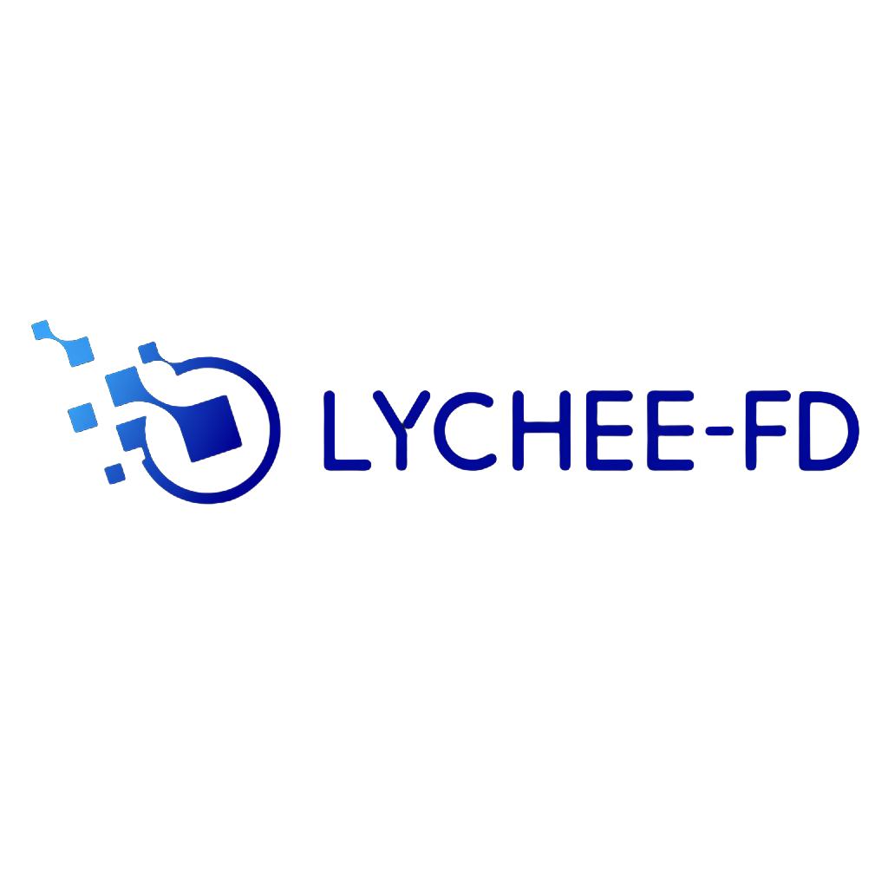
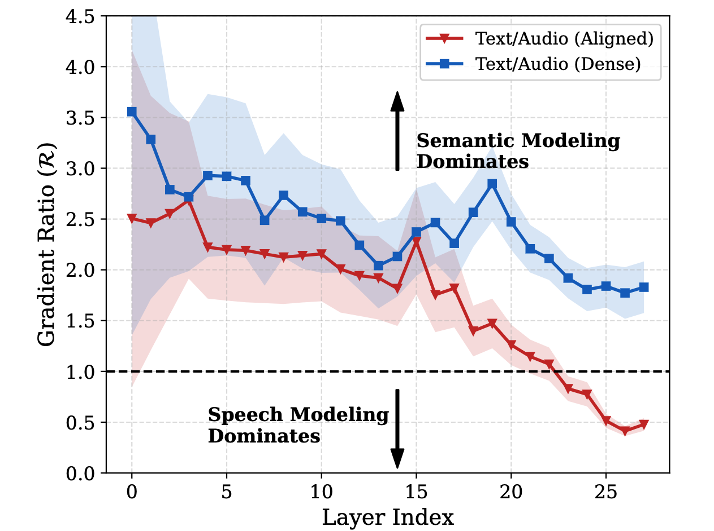
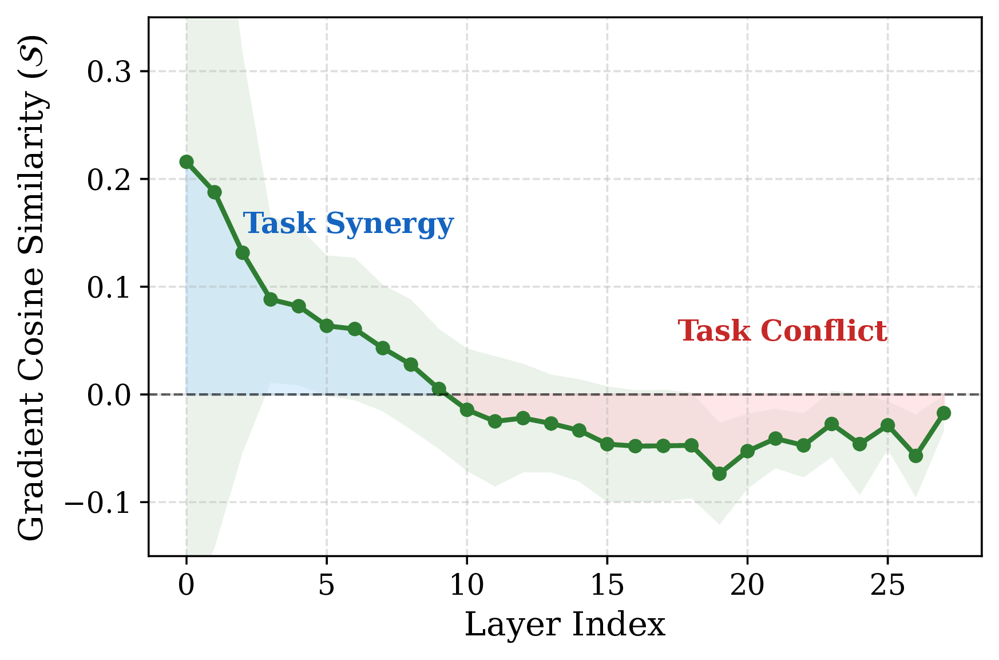
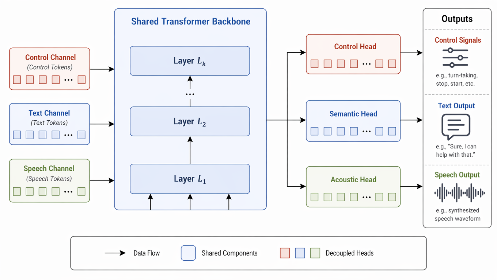
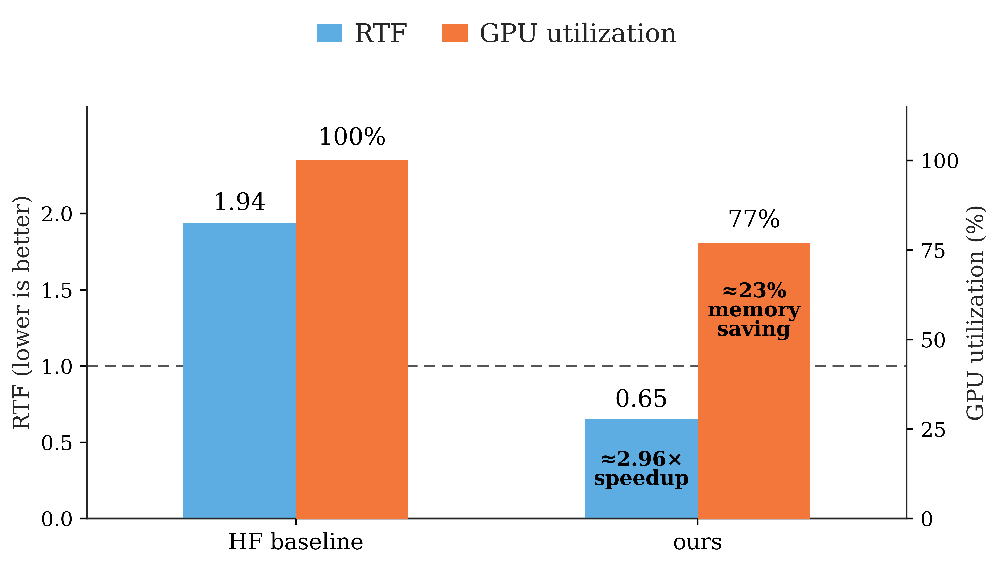

# Lychee-FD

<p align="center">
  
</p>

<h4 align="center">
Lychee-FD is a native end-to-end full-duplex spoken language model for real-time speech interaction.
</h4>

<p align="center">
  <a href="https://huggingface.co/HIT-TMG/Lychee-FD">
    
  </a>
  <a href="https://hitsz-tmg.github.io/Lychee-FD/lychee-fd-showcase/">
    
  </a>
  <a href="https://arxiv.org/pdf/2607.06540">
    
  </a>
</p>

<h4 align="center">
If you appreciate our project, please consider giving us a star ⭐ on GitHub for latest updates.
</h4>

<p align="center">
  <a href="README_CN.md">中文文档</a>
</p>

## 🔥 News

- [2026/07/10] 🎉 We release the Lychee-FD codebase, paper, and web demo.
- [2026/07/07] 🏆 Our paper has been selected as an [**Outstanding Paper**](https://2026.aclweb.org/program/best_papers/#outstanding-papers) at **ACL 2026**!


## 📌 Introduction

**Lychee-FD** is a native end-to-end full-duplex spoken language model designed for real-time speech interaction. Unlike turn-based or system-level full-duplex speech pipelines, Lychee-FD internalizes continuous listening, semantic understanding, speech generation, and interaction control within a unified multi-stream model.

The project is motivated by a key observation: native full-duplex SLMs often suffer from modality interference and semantic dilution, which make it difficult to preserve both speech intelligence and interaction fluency. Lychee-FD addresses these issues through hierarchical acoustic-semantic modeling and a semantic alignment channel, while providing a customized multi-stream vLLM serving pipeline for online interaction.

This repository provides:

- Source code for the Lychee-FD online serving pipeline.
- A browser-based realtime speech interaction frontend.
- vLLM-optimized backend support for low-latency online inference.
- Runtime integration notes and third-party license notices.

## 🌟 Model Structure

Lychee-FD is a native end-to-end full-duplex speech language model designed for realtime spoken interaction. Instead of relying on cascaded ASR, LLM, TTS, and turn-taking modules, it jointly models listening, understanding, speaking, and interaction control within an end-to-end multi-stream architecture.

The architecture is motivated by the optimization dynamics observed in native full-duplex speech modeling. In deeper layers, acoustic generation and semantic reasoning tend to impose increasingly divergent optimization objectives on shared parameters. Meanwhile, high-frequency speech tokens can dilute sparse textual supervision, weakening semantic consistency during speech generation.

<table>
  <tr>
    <td width="50%" align="center">
      
    </td>
    <td width="50%" align="center">
      
    </td>
  </tr>
</table>

Lychee-FD addresses this conflict through hierarchical acoustic-semantic modeling instead of external scheduling. The lower layers are shared to learn common speech-language representations from continuous audio streams, whereas the upper layers are decoupled into semantic, acoustic, and dialogue-control streams. This design enables semantic reasoning to preserve language understanding and knowledge, acoustic modeling to focus on natural speech token generation, and dialogue control to determine when to speak, stop, listen, or respond to interruptions.

<p align="center">
  
</p>

## ⚙️ Engineering Implementation

Real full-duplex interaction must run as an online system. Lychee-FD therefore customizes vLLM for its hierarchical multi-channel architecture: after shared-backbone computation, the backend dispatches intermediate states to semantic, acoustic, and dialogue-control channels, while maintaining the generation state and KV cache required by multi-stream decoding.

This design avoids forcing all specialized channels through a single serial inference path. The control head also uses an early-exit path, allowing interruption, stop-speaking, and listen/respond decisions to be produced before full speech generation completes. In our online evaluation, this vLLM-optimized multi-stream serving pipeline achieves about **2.96x** speedup in speaking rounds and reduces incremental GPU memory growth by about **23%** in long-session runs.

<p align="center">
  
</p>

## Model Weights

The Docker image contains the runtime environment and demo code, but it does not
include model weights. Download the required checkpoints before starting the
demo.

| Component | Source | Expected directory under model root |
| --- | --- | --- |
| Lychee-FD full-duplex model | [HIT-TMG/Lychee-FD](https://huggingface.co/HIT-TMG/Lychee-FD), folder `lychee_full_duplex/` | `lychee_full_duplex/` |
| Token2Wav vocoder | [stepfun-ai/Step-Audio-2-mini](https://huggingface.co/stepfun-ai/Step-Audio-2-mini), folder `token2wav/` | `token2wav/` |

Create one local model root:

```text
/path/to/model-root/
  lychee_full_duplex/
  token2wav/
```

Download the Lychee-FD checkpoint:

```bash
huggingface-cli download HIT-TMG/Lychee-FD \
  --include "lychee_full_duplex/*" \
  --local-dir /path/to/model-root
```

Download Token2Wav from Step-Audio-2-mini:

```bash
huggingface-cli download stepfun-ai/Step-Audio-2-mini \
  --include "token2wav/*" \
  --local-dir /path/to/model-root
```

## 🚀 Docker Quick Start

Clone the repository:

```bash
git clone https://github.com/HITsz-TMG/Lychee-FD.git
cd Lychee-FD
```

Create a local environment file:

```bash
cp .env.docker.example .env
```

Edit `.env` and set the model paths:

```dotenv
LYCHEE_FD_IMAGE=ghcr.io/hitsz-tmg/lychee-fd:latest

HOST_MODEL_ROOT=/path/to/model-root
LYCHEEFD_MODEL_PATH=/models/lychee_full_duplex
LYCHEEFD_T2W_MODEL_PATH=/models/token2wav
```

`HOST_MODEL_ROOT` is the model directory on your host machine. It is mounted into the container as `/models`.

Pull the prebuilt image and start the demo:

```bash
docker compose pull
docker compose up
```

Open:

```text
http://127.0.0.1:8084
```

For a remote server, open `http://<server-ip>:8084`. The browser frontend will
connect to the backend API at `http://<server-ip>:7860`, so both ports `8084`
and `7860` must be reachable from the browser. If you access the server through
SSH port forwarding, forward both ports, for example:

```bash
ssh -L 8084:127.0.0.1:8084 -L 7860:127.0.0.1:7860 user@server
```

## Model Presets

The frontend model list is loaded from:

```text
model_presets_dev.json
```

Update the preset path to the container-side model path:

```json
{
  "name": "lychee_full_duplex",
  "model_path": "/models/lychee_full_duplex",
  "backend_type": "vllm",
  "mode": "stable"
}
```

After editing presets:

```bash
docker compose restart frontend
```

## GPU Settings

By default, token2wav and the main backend use separate GPUs:

```dotenv
TOKEN2WAV_CUDA_VISIBLE_DEVICES=0
BACKEND_CUDA_VISIBLE_DEVICES=1
```

For a single-GPU machine:

```dotenv
TOKEN2WAV_CUDA_VISIBLE_DEVICES=0
BACKEND_CUDA_VISIBLE_DEVICES=0
```

If CUDA OOM occurs, especially when Token2Wav and the backend share one GPU,
reduce the vLLM KV-cache memory budget:

```dotenv
LYCHEEFD_VLLM_GPU_MEMORY_UTILIZATION=0.70
```

The default value is `0.90`. Lower values leave more free GPU memory for
Token2Wav, CUDA kernels, and temporary activations, but reduce the available
vLLM KV-cache capacity. You can also reduce `LYCHEEFD_VLLM_MAX_MODEL_LEN`
from `16384` to `8192` on memory-constrained GPUs.

Check Docker GPU access:

```bash
docker run --rm --gpus all nvidia/cuda:12.4.1-base-ubuntu22.04 nvidia-smi
```

## Common Commands

Run in background:

```bash
docker compose up -d
```

View logs:

```bash
docker compose logs -f
```

Stop:

```bash
docker compose down
```

Pull the latest image:

```bash
docker compose pull
docker compose up -d
```

## Source Installation

Docker is the recommended and reproducible deployment path. Source-based
installation is mainly intended for development or debugging, because the vLLM
and FlashAttention wheels must match the local CUDA/PyTorch stack.

Create the backend Python environment from the provided lock files:

```bash
conda env create -f environment.yml
conda activate lychee-fd
python -m pip install -r requirements.txt
python -m pip install --no-build-isolation "flash-attn==2.8.2"
```

The environment files reproduce the backend stack used by the released Docker
image, including Python 3.10, PyTorch 2.5.1, CUDA 12.x runtime packages,
vLLM 0.6.5, and the remaining serving dependencies. `flash-attn` is installed
separately because it is sensitive to the local CUDA/PyTorch build; if building
from source is slow or unavailable, install a prebuilt wheel that matches your
machine.

The online vLLM backend requires two pieces at the same time:

- an installed vLLM wheel in the conda environment, which provides compiled
  native libraries such as `_C.abi3.so`, `_moe_C.abi3.so`, and
  `vllm_flash_attn_c.abi3.so`;
- the patched source tree in `third_party/vllm`, which implements the
  Lychee-FD multi-stream serving path.

Before launching from source, point the scripts to the conda environment and the
patched vLLM source tree:

```bash
export LYCHEEFD_CONDA_ENV_PATH="${CONDA_PREFIX}"
export STEPAUDIO2_SOURCE_DIR="${PWD}/third_party/Step-Audio2"
export LYCHEEFD_VLLM_SOURCE_DIR="${PWD}/third_party/vllm"
export LYCHEEFD_VLLM_SYNC_FLASH_ATTN=1
export LYCHEEFD_VLLM_FORCE_SYNC_FLASH_ATTN=1
```

`scripts/start_backend.sh` will prepend `LYCHEEFD_VLLM_SOURCE_DIR` to
`PYTHONPATH` and synchronize the native vLLM/FlashAttention artifacts from the
installed wheel into the patched source tree. This step is required; importing
plain site-packages vLLM will not use the Lychee-FD serving implementation.

Install frontend dependencies once:

```bash
cd frontend
npm ci
cd ..
```

Start the Token2Wav sidecar:

```bash
CUDA_VISIBLE_DEVICES=0 \
LYCHEEFD_T2W_MODEL_PATH=/path/to/token2wav \
./scripts/start_token2wav_server.sh
```

Start the frontend and realtime backend controller:

```bash
CUDA_VISIBLE_DEVICES=1 \
LYCHEEFD_CONDA_ENV_PATH=${CONDA_PREFIX} \
STEPAUDIO2_SOURCE_DIR=${PWD}/third_party/Step-Audio2 \
LYCHEEFD_VLLM_SOURCE_DIR=${PWD}/third_party/vllm \
LYCHEEFD_VLLM_SYNC_FLASH_ATTN=1 \
LYCHEEFD_VLLM_FORCE_SYNC_FLASH_ATTN=1 \
ALLOWED_MODEL_ROOT=/path/to/model/root \
AUTO_LOAD_DEFAULT=0 \
LYCHEEFD_REALTIME_STRICT_INFER_WINDOW=1 \
LYCHEEFD_STOKEN_DELAY_NUM=10 \
LYCHEEFD_TTS_VOCODER_HOP_SIZE=10 \
LYCHEEFD_T2W_STREAM_LOOKAHEAD_LEN=3 \
LYCHEEFD_T2W_REMOTE_ENABLED=1 \
LYCHEEFD_T2W_REMOTE_URL=http://127.0.0.1:8091 \
LYCHEEFD_T2W_REMOTE_FALLBACK=0 \
LYCHEEFD_USE_VLLM=1 \
LYCHEEFD_VLLM_MAX_MODEL_LEN=16384 \
LYCHEEFD_VLLM_GPU_MEMORY_UTILIZATION=0.90 \
./scripts/start_frontend_dev.sh prod public
```

Open `http://127.0.0.1:8084` after both services are ready.

## Third-Party Code

This repository vendors selected third-party components for the demo and online
serving pipeline. See [third_party/THIRD_PARTY_NOTICES.md](third_party/THIRD_PARTY_NOTICES.md)
for upstream sources, license notices, and local integration notes.

## License

Lychee-FD is released under the [Apache License 2.0](LICENSE).

Copyright 2026 HITsz-TMG and Lychee-FD authors.

## 📚 Citation

If you find Lychee-FD useful, please cite our paper:

```bibtex
@inproceedings{liu-etal-2026-hierarchical,
    title = "Hierarchical Acoustic-Semantic Modeling: Modality Separation and Semantic Coherence for Full-Duplex {SLM}s",
    author = "Liu, Zhenyu  and
      Zhang, Xuanyu  and
      Li, Yunxin  and
      Teng, Qixun  and
      Jiang, Shenyuan  and
      Chen, Haolan  and
      Zhao, Mingjun  and
      Meng, Fanbo  and
      Xu, Yu  and
      He, Yancheng  and
      Hu, Baotian  and
      Li, Haizhou  and
      Zhang, Min",
    editor = "Liakata, Maria  and
      Moreira, Viviane P.  and
      Zhang, Jiajun  and
      Jurgens, David",
    booktitle = "Proceedings of the 64th Annual Meeting of the {A}ssociation for {C}omputational {L}inguistics (Volume 1: Long Papers)",
    month = jul,
    year = "2026",
    address = "San Diego, California, United States",
    publisher = "Association for Computational Linguistics",
    url = "https://aclanthology.org/2026.acl-long.419/",
    doi = "10.18653/v1/2026.acl-long.419",
    pages = "9264--9280",
    ISBN = "979-8-89176-390-6"
}
```
