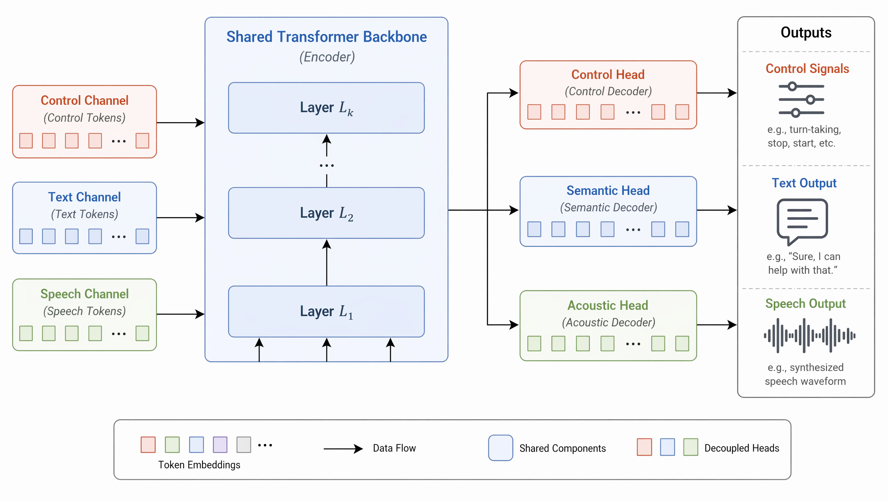

# Lychee-FD

<p align="center">
  
</p>

<h4 align="center">
Lychee-FD is a full-duplex realtime speech interaction system designed for low-latency spoken dialogue.
</h4>

<p align="center">
  <a href="https://huggingface.co/PLACEHOLDER/Lychee-FD">
    
  </a>
  <a href="https://hitsz-tmg.github.io/Lychee-FD/">
    
  </a>
  <a href="https://arxiv.org/pdf/2607.06540">
    
  </a>
</p>

<h4 align="center">
If you appreciate our project, please consider giving us a star ⭐ on GitHub to stay updated with the latest developments.
</h4>

## 🔥 News

- [2026/07/10] 🎉 We release the Lychee-FD codebase, paper, and web demo.
- [2026/07/07] 🏆 Our paper has been selected as an [**Outstanding Paper**](https://aclanthology.org/2026.acl-long.419) at **ACL 2026**!


## 📌 Introduction

**Lychee-FD** is a full-duplex realtime speech interaction system designed for low-latency spoken dialogue. Unlike conventional turn-based speech systems, Lychee-FD supports simultaneous listening and speaking, enabling more natural interactive behaviors such as realtime response generation, interruption handling, and streaming speech output.

This repository provides:

- Source code for the Lychee-FD online serving pipeline.
- A browser-based realtime speech interaction frontend.
- Docker Compose configuration for quick deployment.
- vLLM-optimized backend support for low-latency online inference.
- Runtime integration notes and third-party license notices.

## 📀 Demo Video

[**todo**] 这里放web demo + 数字人 + 机器人 各10秒演示的视频

## 🌟 Model Structure

Lychee-FD is a native end-to-end full-duplex speech language model designed for realtime spoken interaction. Instead of relying on cascaded ASR, LLM, TTS, and turn-taking modules, it jointly models listening, understanding, speaking, and interaction control within an end-to-end multi-stream architecture.

The architecture is motivated by the optimization dynamics observed in native full-duplex speech modeling. In deeper layers, acoustic generation and semantic reasoning tend to impose increasingly divergent optimization objectives on shared parameters. Meanwhile, high-frequency speech tokens can dilute sparse textual supervision, weakening semantic consistency during speech generation.

<table>
  <tr>
    <td width="50%" align="center">
      
    </td>
    <td width="50%" align="center">
      
    </td>
  </tr>
</table>

Lychee-FD addresses this conflict through hierarchical acoustic-semantic modeling instead of external scheduling. The lower layers are shared to learn common speech-language representations from continuous audio streams, whereas the upper layers are decoupled into semantic, acoustic, and dialogue-control streams. This design enables semantic reasoning to preserve language understanding and knowledge, acoustic modeling to focus on natural speech token generation, and dialogue control to determine when to speak, stop, listen, or respond to interruptions.

<p align="center">
  
</p>

This architecture also introduces distinct serving requirements. Standard LLM inference engines are optimized for a single forward path and a single output stream, while sequentially executing Lychee-FD's specialized streams would introduce avoidable latency. Our vLLM-optimized online pipeline reuses shared-backbone computation, dispatches intermediate states to stream-specific branches, and manages KV cache for multi-stream generation. The control stream further supports early-exit decisions, enabling interruption and turn-taking signals to be emitted before full speech generation is completed.

> **TODO:** Replace the following vLLM pipeline figure with the final version.

<p align="center">
  
</p>

The online pipeline separates realtime audio ingestion, state-aware full-duplex inference, vLLM-optimized response generation, and streaming token-to-waveform synthesis.

## Online Serving 


Performance

We compare the Hugging Face online backend with the vLLM online backend on an evaluation subset. Each online round consumes a fixed 400 ms audio window, so the key metric is whether backend computation finishes before the next window arrives.

| Scope | HF rounds | vLLM rounds | HF mean compute / window | vLLM mean compute / window | Speedup | HF window RTF | vLLM window RTF | HF within window | vLLM within window |
| --- | ---: | ---: | ---: | ---: | ---: | ---: | ---: | ---: | ---: |
| All rounds | 15,191 | 15,191 | 288.49 ms | 249.30 ms | 1.16x | 0.721 | 0.623 | 70.8% | **99.5%** |
| Speaking rounds | 4,470 | 4,183 | 777.50 ms | **261.50 ms** | **2.97x** | 1.944 | **0.654** | 0.6% | **98.5%** |
| Listening rounds | 10,701 | 11,003 | 84.70 ms | 244.77 ms | 0.35x | 0.212 | 0.612 | **100.0%** | **99.9%** |

**Key points:**

- **Speaking rounds are the critical online workload:** vLLM reduces mean compute from 777.50 ms to 261.50 ms and raises within-window completion from 0.6% to 98.5%.
- **Overall realtime stability improves:** across all rounds, vLLM finishes 99.5% of windows within the 400 ms budget.
- **Long-context memory growth is reduced:** in controlled long-session runs, vLLM showed about 23% lower incremental GPU memory growth than the HF backend over a comparable 5 minutes audio stream.

`window RTF = round_compute_ms / 400 ms`; values below 1.0 indicate that the backend finishes processing the current audio window before the next window arrives.

## Model Weights

The Docker image contains the runtime environment and demo code, but it does not
include model weights. Download the required checkpoints before starting the
demo.

| Component | Source | Expected directory under model root |
| --- | --- | --- |
| Lychee-FD full-duplex model | [HIT-TMG/Lychee-FD](https://huggingface.co/HIT-TMG/Lychee-FD), folder `lychee_full_duplex_v1.5/` | `lychee_full_duplex_v1.5/` |
| Token2Wav vocoder | [stepfun-ai/Step-Audio-2-mini](https://huggingface.co/stepfun-ai/Step-Audio-2-mini), folder `token2wav/` | `token2wav/` |

Create one local model root:

```text
/path/to/model-root/
  lychee_full_duplex_v1.5/
  token2wav/
```

Download the Lychee-FD checkpoint:

```bash
huggingface-cli download HIT-TMG/Lychee-FD \
  --include "lychee_full_duplex_v1.5/*" \
  --local-dir /path/to/model-root
```

Download Token2Wav from Step-Audio-2-mini:

```bash
huggingface-cli download stepfun-ai/Step-Audio-2-mini \
  --include "token2wav/*" \
  --local-dir /path/to/model-root
```

## 🚀 Docker Quick Start

Clone the repository:

```bash
git clone https://github.com/HITsz-TMG/Lychee-FD.git
cd Lychee-FD
```

Create a local environment file:

```bash
cp .env.docker.example .env
```

Edit `.env` and set the model paths:

```dotenv
LYCHEE_FD_IMAGE=ghcr.io/idealistxy/lychee-fd:latest

HOST_MODEL_ROOT=/path/to/model-root
STEPAUDIO_MODEL_PATH=/models/lychee_full_duplex_v1.5
STEPAUDIO_T2W_MODEL_PATH=/models/token2wav
```

`HOST_MODEL_ROOT` is the model directory on your host machine. It is mounted into the container as `/models`.

Pull the prebuilt image and start the demo:

```bash
docker compose pull
docker compose up
```

Open:

```text
http://127.0.0.1:8084
```

For a remote server, open `http://<server-ip>:8084`. The browser frontend will
connect to the backend API at `http://<server-ip>:7860`, so both ports `8084`
and `7860` must be reachable from the browser. If you access the server through
SSH port forwarding, forward both ports, for example:

```bash
ssh -L 8084:127.0.0.1:8084 -L 7860:127.0.0.1:7860 user@server
```

## Model Presets

The frontend model list is loaded from:

```text
model_presets_dev.json
```

Update the preset path to the container-side model path:

```json
{
  "name": "lychee_full_duplex_v1.5",
  "model_path": "/models/lychee_full_duplex_v1.5",
  "backend_type": "vllm",
  "mode": "stable"
}
```

After editing presets:

```bash
docker compose restart frontend
```

## GPU Settings

By default, token2wav and the main backend use separate GPUs:

```dotenv
TOKEN2WAV_CUDA_VISIBLE_DEVICES=0
BACKEND_CUDA_VISIBLE_DEVICES=1
```

For a single-GPU machine:

```dotenv
TOKEN2WAV_CUDA_VISIBLE_DEVICES=0
BACKEND_CUDA_VISIBLE_DEVICES=0
```

If CUDA OOM occurs, especially when Token2Wav and the backend share one GPU,
reduce the vLLM KV-cache memory budget:

```dotenv
STEPAUDIO_VLLM_GPU_MEMORY_UTILIZATION=0.70
```

The default value is `0.90`. Lower values leave more free GPU memory for
Token2Wav, CUDA kernels, and temporary activations, but reduce the available
vLLM KV-cache capacity. You can also reduce `STEPAUDIO_VLLM_MAX_MODEL_LEN`
from `16384` to `8192` on memory-constrained GPUs.

Check Docker GPU access:

```bash
docker run --rm --gpus all nvidia/cuda:12.4.1-base-ubuntu22.04 nvidia-smi
```

## Common Commands

Run in background:

```bash
docker compose up -d
```

View logs:

```bash
docker compose logs -f
```

Stop:

```bash
docker compose down
```

Pull the latest image:

```bash
docker compose pull
docker compose up -d
```

## Source Installation (Advanced)

Docker is the recommended and reproducible deployment path. Source-based
installation is mainly intended for development or debugging, because the vLLM
and FlashAttention wheels must match the local CUDA/PyTorch stack.

Create the backend Python environment from the provided lock files:

```bash
conda env create -f environment.yml
conda activate lychee-fd
python -m pip install -r requirements.txt
python -m pip install --no-build-isolation "flash-attn==2.8.2"
```

The environment files reproduce the backend stack used by the released Docker
image, including Python 3.10, PyTorch 2.5.1, CUDA 12.x runtime packages,
vLLM 0.6.5, and the remaining serving dependencies. `flash-attn` is installed
separately because it is sensitive to the local CUDA/PyTorch build; if building
from source is slow or unavailable, install a prebuilt wheel that matches your
machine.

The online vLLM backend requires two pieces at the same time:

- an installed vLLM wheel in the conda environment, which provides compiled
  native libraries such as `_C.abi3.so`, `_moe_C.abi3.so`, and
  `vllm_flash_attn_c.abi3.so`;
- the patched source tree in `third_party/vllm`, which implements the
  Lychee-FD multi-stream serving path.

Before launching from source, point the scripts to the conda environment and the
patched vLLM source tree:

```bash
export STEPAUDIO_CONDA_ENV_PATH="${CONDA_PREFIX}"
export STEPAUDIO2_SOURCE_DIR="${PWD}/third_party/Step-Audio2"
export STEPAUDIO_VLLM_SOURCE_DIR="${PWD}/third_party/vllm"
export STEPAUDIO_VLLM_SYNC_FLASH_ATTN=1
export STEPAUDIO_VLLM_FORCE_SYNC_FLASH_ATTN=1
```

`scripts/start_backend.sh` will prepend `STEPAUDIO_VLLM_SOURCE_DIR` to
`PYTHONPATH` and synchronize the native vLLM/FlashAttention artifacts from the
installed wheel into the patched source tree. This step is required; importing
plain site-packages vLLM will not use the Lychee-FD serving implementation.

Install frontend dependencies once:

```bash
cd frontend
npm ci
cd ..
```

Then follow the source launch commands in [启动指南.md](启动指南.md).

## Third-Party Code

This repository vendors selected third-party components for the demo and online
serving pipeline. See [third_party/THIRD_PARTY_NOTICES.md](third_party/THIRD_PARTY_NOTICES.md)
for upstream sources, license notices, and local integration notes.

## License

Lychee-FD is released under the [Apache License 2.0](LICENSE).

Copyright 2026 HITsz-TMG and Lychee-FD authors.

## Detailed Guide

See [启动指南.md](启动指南.md) for more startup details and optional source-based launch commands.
